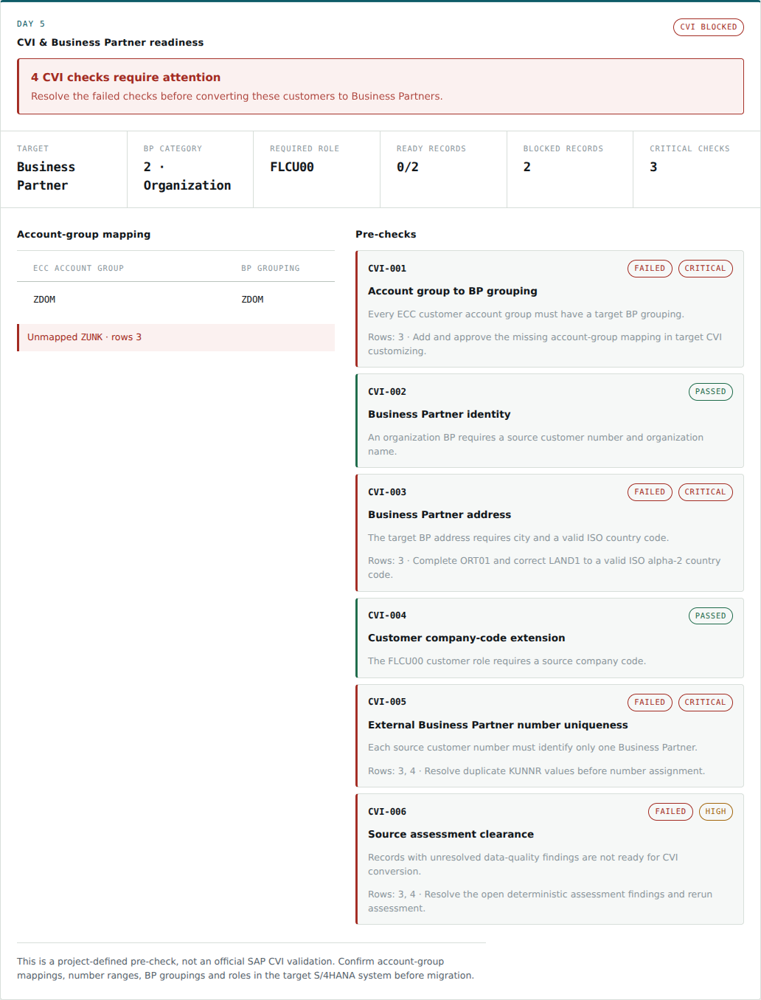
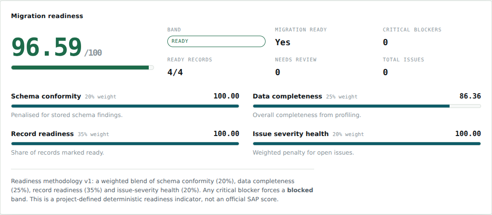
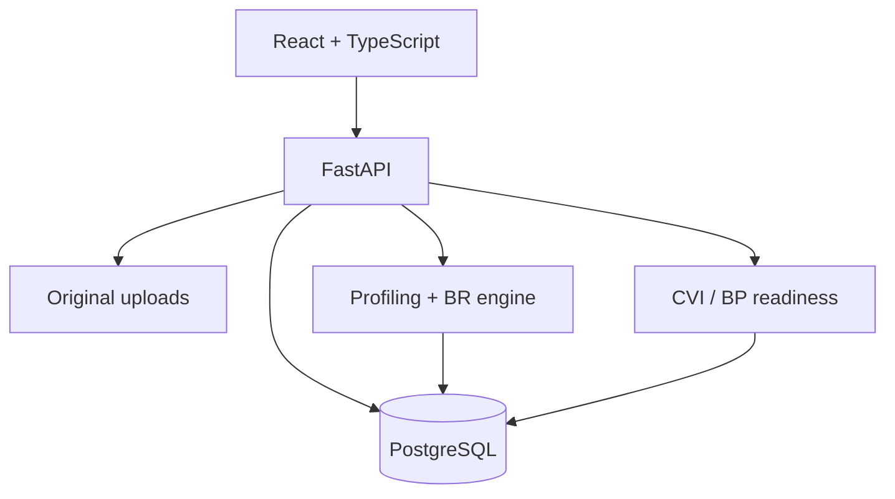

# SAP S/4HANA Migration Co-Pilot

[](https://github.com/param0709/sap-s4hana-migration-project/actions/workflows/ci.yml)


A consultant-facing workspace for assessing SAP ECC Customer Master extracts before an
S/4HANA migration. Through **Day 5**, it preserves source evidence, profiles data, runs
14 deterministic business rules, calculates a transparent Migration Readiness Score,
and evaluates CVI / Business Partner readiness.

The application deliberately separates project-defined indicators from SAP truth. It
does not call a local score an official SAP validation, and its demo CVI mappings must be
replaced with client-approved target customizing on a real engagement.

## Day 5 in the product





## What works

| Day | Capability | Status |
|---|---|---|
| 1 | Migration project creation and resumable project list | Complete |
| 2 | CSV/XLSX upload, parse safety and ECC schema validation | Complete |
| 3 | Immutable/working row persistence and deterministic profiling | Complete |
| 4 | `BR-001`–`BR-014`, persisted issues and Migration Readiness Score | Complete |
| 5 | CVI / Business Partner readiness, BP role and account-group mapping checks | Complete |

Day 5 adds six explicit CVI checks, source-row blockers, demo account-group mappings,
BP category `2` (Organization) and customer role `FLCU00`. See the
[CVI methodology](docs/07_cvi_business_partner_readiness.md).

## Architecture



The backend owns all scoring and checks; the UI only renders typed results. Accepted rows
retain the spreadsheet/CSV row number consultants see, including gaps caused by blank
rows. If database persistence fails after writing an upload, that original is removed so
storage cannot accumulate an orphan. Read the [architecture notes](docs/ARCHITECTURE.md)
for the full request flow.

## Run locally

Requirements: Docker Desktop or Docker Engine with Compose.

```bash
cp .env.example .env
docker compose up --build
```

Open:

- Application: <http://localhost:5173>
- Interactive API documentation: <http://localhost:8000/docs>
- Health check: <http://localhost:8000/api/v1/health>

Migrations run automatically when the backend container starts.

## Repeatable Day 5 demo

With the stack running, create, upload and assess a CVI-ready project through public APIs:

```bash
python scripts/demo_day5.py
```

To demonstrate source-row blockers, unknown BP groupings and duplicate customer numbers:

```bash
python scripts/demo_day5.py --file sample-data/day5_cvi_blocked_customers.csv
```

The command prints both readiness responses and a browser URL for the new project. The
sample records are synthetic.

## API surface

| Capability | Endpoint |
|---|---|
| Health | `GET /api/v1/health` |
| Create/list/get projects | `POST/GET /api/v1/projects` |
| Upload ECC file | `POST /api/v1/projects/{project_id}/files/ecc` |
| List project files | `GET /api/v1/projects/{project_id}/files` |
| Profile source file | `GET .../files/{file_id}/profile` |
| Run assessment | `POST .../files/{file_id}/assessment` |
| List persisted issues | `GET .../files/{file_id}/issues` |
| Migration readiness | `GET .../files/{file_id}/readiness` |
| CVI / BP readiness | `GET .../files/{file_id}/cvi-readiness` |
| ECC/CVI references | `GET /api/v1/reference/ecc-schema`, `GET /api/v1/reference/cvi` |

## Validation and readiness correctness

Required columns are `KUNNR`, `NAME1`, `ORT01`, `LAND1`, `KTOKD` and `BUKRS`. Schema
validation detects missing, duplicate, blank and unexpected headers. The business-rule
engine separately rejects blank values in every mandatory field, so a file with the
right headers but empty city, country, account group or company code can no longer be
reported as migration-ready.

The Day 4 score combines schema conformity (20%), data completeness (25%), record
readiness (35%) and issue-severity health (20%). Any critical issue or critical schema
finding forces the `blocked` band and `migration_ready = false`, regardless of the
numeric score. This is a transparent project methodology, not an official SAP score.

## Quality and security

```bash
# Backend
cd backend
python -m venv .venv
. .venv/bin/activate
pip install -r requirements-dev.txt
pytest --cov=app --cov-fail-under=90
pip-audit -r requirements.txt

# Frontend
cd ../frontend
npm ci
npm test
npm run build
npm audit --audit-level=moderate
```

GitHub Actions runs backend tests and migrations, frontend tests/build, a 90% coverage
gate, and Python/npm dependency audits. Dependabot checks Python, npm and Actions weekly.

Current local verification: **174 backend tests** and **29 frontend tests** pass; both
dependency audits report zero known vulnerabilities.

## Roadmap after Day 5

- Import client-approved target CVI customizing and number ranges.
- Add field mapping, human review and approved transformations.
- Produce S/4HANA load files with reconciliation and audit exports.
- Add semantic duplicate suggestions and cited consultant assistance without automatic
  data mutation.

The original [functional requirements](docs/03_functional_requirements.md),
[scope](docs/02_scope.md) and [data dictionary](docs/06_data_dictionary.md) remain the
design baseline.
