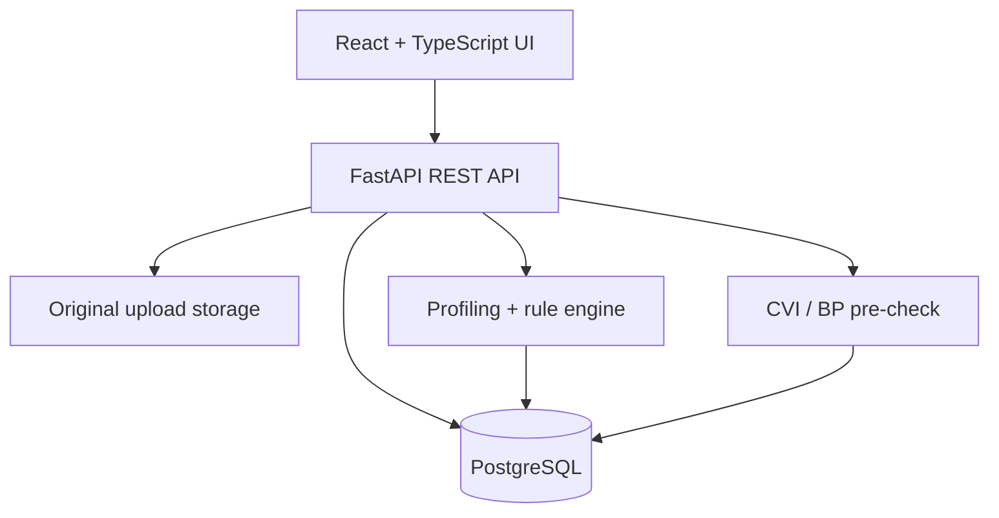

# Architecture

The application keeps raw source evidence, deterministic assessment and presentation
separate. Uploads are stored byte-for-byte, while parsed rows are persisted twice:
`original_data` remains immutable and `working_data` is reserved for later approved
transformations.

## Request flow

1. The upload boundary enforces file size, extension and parse safety.
2. The parser normalizes headers but retains each nonblank record's true source row.
3. Storage and database persistence form one logical operation: a failed transaction
   removes the just-written original, avoiding an orphaned upload.
4. Profiling reads `original_data`; assessment writes deterministic issues and record
   status; readiness endpoints only read the resulting state.
5. The frontend consumes typed API contracts and never recomputes readiness scores.

## Components

| Layer | Technology | Responsibility |
|---|---|---|
| Web | React 18, TypeScript, Vite | Project, upload, profiling, issue, Day 4 and Day 5 views |
| API | FastAPI, Pydantic | HTTP contracts, scoped project/file access, structured errors |
| Domain | Pure Python services | Profiling, `BR-001`–`BR-014`, readiness and CVI checks |
| Persistence | SQLAlchemy, Alembic, PostgreSQL | Projects, uploads, immutable/working rows and issues |
| File storage | Configured local/volume path | Byte-for-byte uploaded originals |
| Quality | Pytest, Vitest, GitHub Actions | Coverage, builds, migrations and dependency audits |
